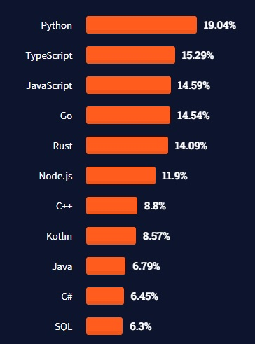
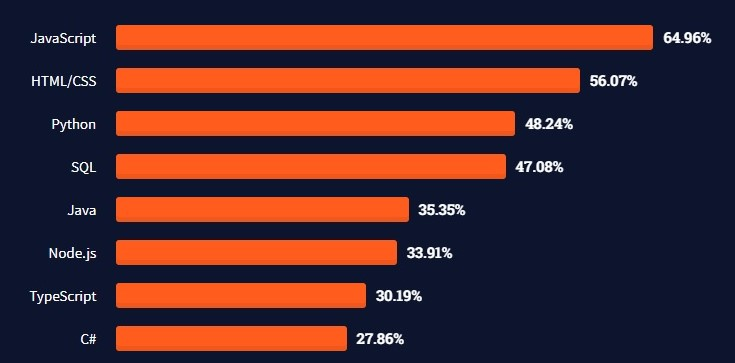

# Python Demo
## Part 1: The Basics
> :wave: Peter O'Connor
> :calendar: September 23rd, 2021
<!--  -->

---
# What is Python?
- Python is a high-level, general purpose programming language
- Created by Guido van Rossum and first released on February 20, 1991 :astonished:
- Probably the only language named after a comedy show
- Unique syntax
- Multi-paradigm
- Interpreted (CPython, Jython, IronPython, PyPy)
- Garbage collected :relieved:
- Dynamically typed

---
# Why Python?
- Simple to learn
- Easy to read and understand
- Simple to use
- Great community
- In high demand
- Widely used
> Source: [SO Survey 2021](https://insights.stackoverflow.com/survey/2021)

---
# Python Pro's and Con's
- :thumbsup: Comprehensive [standard library](https://docs.python.org/3/library/)
- :thumbsup: Community driven ([PEP 20](https://www.python.org/dev/peps/pep-0020/))
- :thumbsup: Third party packages :worried:
- :thumbsup: Third party tools
- :thumbsdown: Interpreted
- :thumbsdown: Not native
- :thumbsdown: Dynamic

---
# Hello, World! (REPL)
- Download from [python.org](https://www.python.org/downloads/release/python-397/) and install
- Open a new command prompt and type `python`
- `print("Hello, World!")`

## Hello, World! (IDE)
- (VS Code) Install the [Python extension](https://marketplace.visualstudio.com/items?itemName=ms-python.python)
- Follow the [getting started guide](https://code.visualstudio.com/docs/python/python-tutorial)
- Not just VS Code (Visual Studio, PyCharm, IntelliJ IDEA)

---
# Variables
- Use the `=` assignment operator e.g. `a = 10` `b = 20`
- Dynamically typed
<!-- - Strings are collections of characters
    - Double or single quotes
    - Triple double/single quotes to span multiple lines
    - Can be sliced/indexed -->
- Use `type()` to check

# Operators
- As expected `+ - * /`
- Also: `// % ** += -=`

---
# Conditions
- Decisions: `if` `elif` `else`
- Comparisons: `< > <= >= == !=`
- More *Pythonic* `is` `is not` for object comparisons
- Boolean operators: `and` `or` `not`
- Demo: `rock_paper_scissors.py`

---
# Collections/Looping
- Collection types: `tuple` `list` `dict`
- Indexing: `[0]` `[-1]`
- Slicing: `[0:2]` `[1:-1]`
- Looping: `for in` `for range` `while`

---
# Functions
- Syntax: `def function_name(arg1, arg2, ...):`
- Can return values using `return`
- Can return multiple values
- `*args` & `**kwargs`
- Are first class citizens (functional paradigm)

---
# Object Orientation
- At its heart Python is really an object-oriented language
- Demo: `oo.py`

---
# Modules
- Python modules help keep code separate promoting cleaner structure and code reuse
- A module is just another Python file - no special syntax required!
- Use `import` to load the module
- Demo: `maths/artithmetic.py`

---
# Packages
- There's probably a package out there for any task you need to accomplish
- Package repository: [Python Package Index](https://pypi.org/) (aka PyPi)
- Use the Package Installer for Python `pip` to install packages (comes with Python)
- Prevent package version compatability issues by taking advantage of Python virtual environments
- Demo: `iss.py`

---
# Thanks for listening!
- Part 2 (TBC) - Advanced Python features (lambdas, decorators, iterators, generators etc.), Concurrency, Testing, Performance, Data Science
- Any other topics you'd like to see?